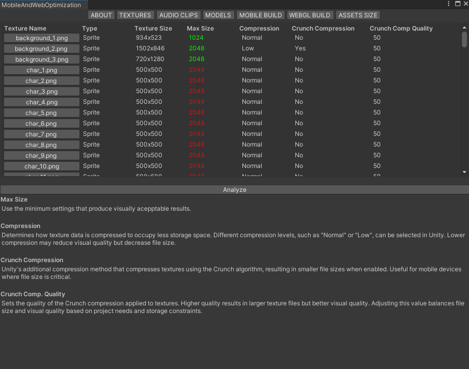
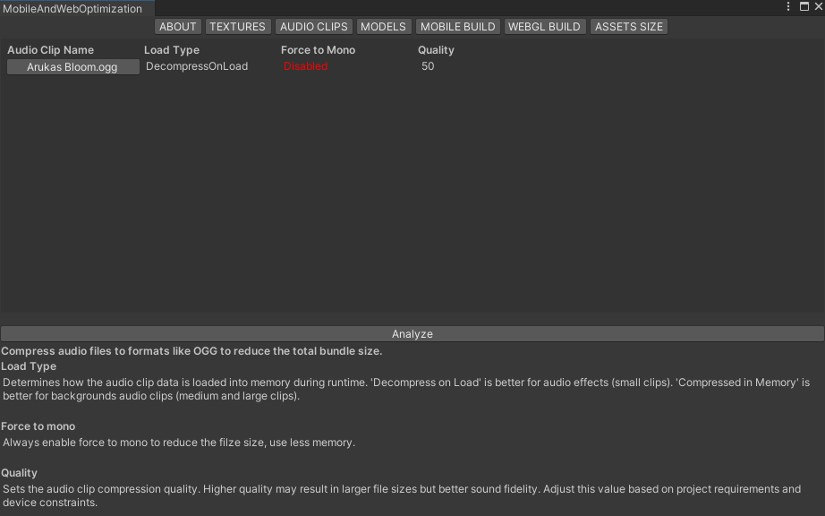
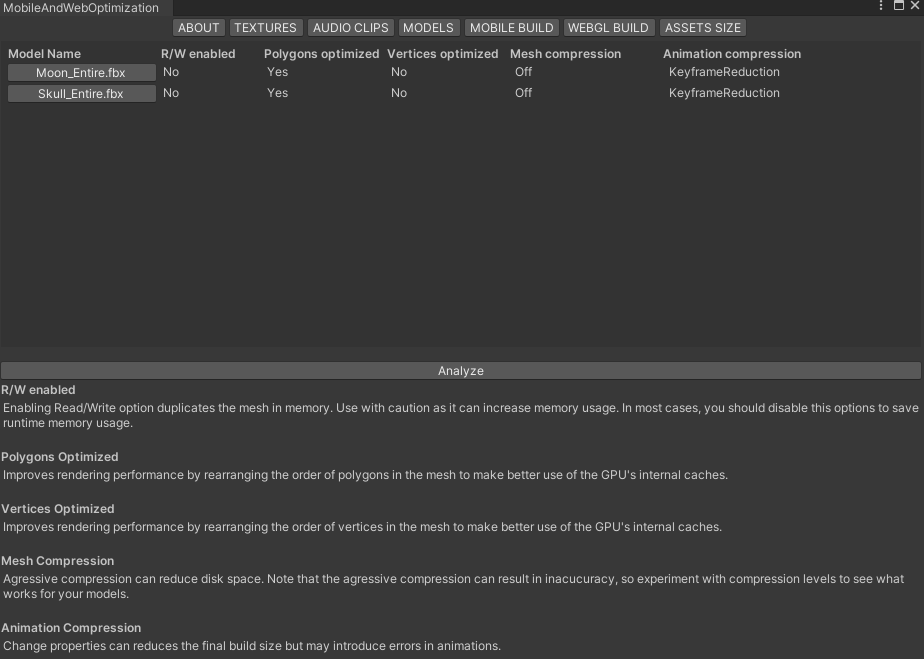
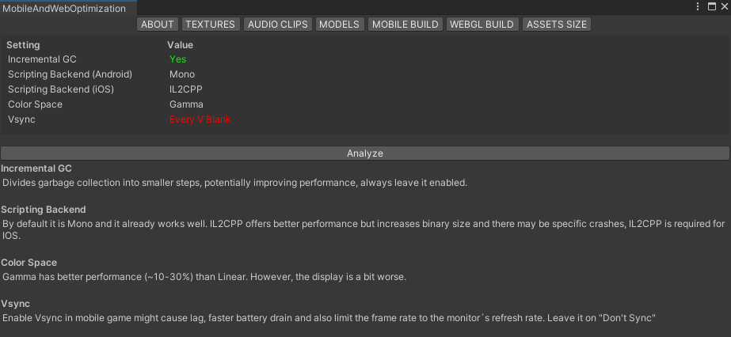
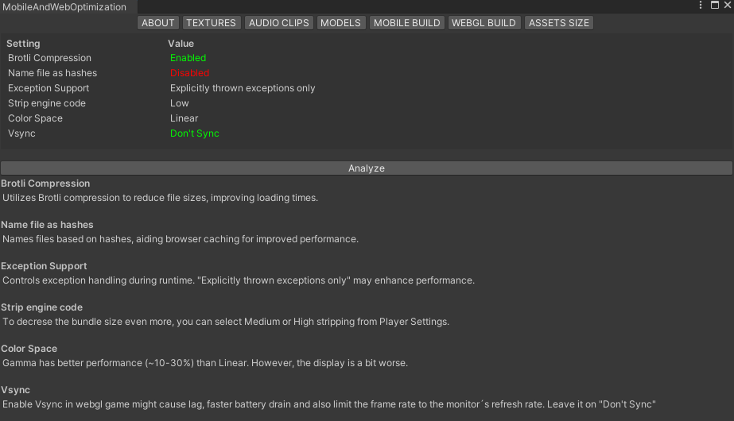

# Unity Mobile and WebGL Optimization

**Unity Mobile and WebGL Optimization** is a simple editor that displays optimization tips for mobile game development and WebGL. You can access it through ```Window/Nato Optimization/Mobile and WebGL Optimization```

## Categories

- [Textures](#textures)
- [Audio Clips](#audio-clips)
- [Models](#models)
- [Mobile Build](#mobile-build)
- [WebGL Build](#webgl-build)

---

## Textures

Most of the memory usage and project file size comes from texture modifications. Therefore, the settings in this category are critical when optimizing for mobile or WebGL. Follow these guidelines:

- **Max Size**: Use the minimum settings that produce visually acceptable results.
- **Compression**: Determines how texture data is compressed to occupy less storage space.
- **Crunch Compression**: Additional compression method using the Crunch algorithm, resulting in smaller file sizes.
- **Crunch Comp Quality**: Sets the quality of the Crunch compression applied to textures.



---

## Audio Clips

Audio clips also influence the final project file size, especially when dealing with large clips in formats like WAV. Here are the guidelines:

- **Compress audio files** to reduce the total bundle size.
- **Load Type**: Determines how the audio clip data is loaded into memory during runtime.
- **Force to Mono**: Always enable to reduce file size and use less memory.
- **Quality**: Sets the audio clip compression quality.



---

## Models

Similar to textures, models can consume excessive memory. Here are the guidelines:

- **Read/Write**: Enabling Read/Write option duplicates the mesh in memory.
- **Polygons Optimized**: Improves rendering performance by rearranging the order of polygons in the mesh.
- **Vertices Optimized**: Improves rendering performance by rearranging the order of vertices in the mesh.
- **Mesh Compression**: Agressive compression can reduce disk space.
- **Animation Compression**: Reduces the final build size but may introduce errors in animations.



---

## Mobile Build

Here are the main settings that influence the final performance of projects for Android or iOS:

- **Incremental GC**: Divides garbage collection into smaller steps, potentially improving performance.
- **Scripting Backend**: Mono by default, IL2CPP offers better performance but increases binary size.
- **Color Space**: Gamma has better performance than Linear.
- **VSync**: Enable Vsync might cause lag and faster battery drain. Leave it on "Don't Sync".



---

## WebGL Build

Here are the main settings that influence the final performance of projects for WebGL:

- **Brotli Compression**: Utilizes Brotli compression to reduce file sizes.
- **Name File as Hashes**: Names files based on hashes, aiding browser caching.
- **Exception Support**: Controls exception handling during runtime.
- **Strip Engine Code**: To decrese the bundle size even more.
- **Color Space**: Gamma has better performance than Linear.
- **VSync**: Enable Vsync in webgl game might cause lag and faster battery drain.



## Links
- Author: [@natomarcacini](https://www.github.com/natomarcacini)
  
[](https://renatomarcacini.github.io/portfolio/)
[](https://www.linkedin.com/in/renato-gomes-marcacini-50b78b1a7)
